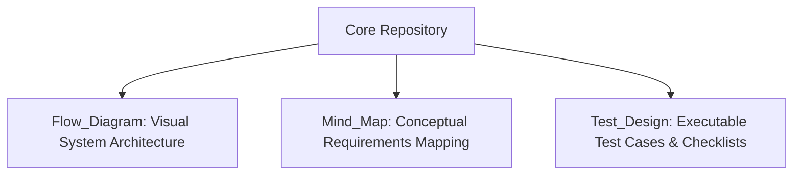

# 🗺️ Urban Routes - Analysis of Requirements and Test Cases Design

*Read this document in other languages: [Español (Spanish)](./README_ES.md)*

---

## 📋 Project Overview
This repository contains the comprehensive **Requirements Analysis and Test Design Suite** executed on the **Urban Routes Car-Sharing platform**. The primary goal of this phase was to deconstruct complex business requirements (specifically surrounding route calculation, fee structures, user profiles, and licensing logic) into highly traceable, executable test cases.

By transforming raw product specifications into logical maps and formal test metrics, we ensured maximum functional coverage prior to test execution.

---

## 🛠️ Applied Test Design Techniques
To optimize test coverage and prevent redundancy, professional black-box test design techniques were strictly applied:

*   **Equivalence Class Partitioning (ECP):** Segregated input domains for ride-sharing options (e.g., driver search limits, passenger capacity, and vehicle licensing restrictions).
*   **Boundary Value Analysis (BVA):** Evaluated critical operational thresholds, such as route distance edge cases, numerical boundaries for taxi fares, and valid system constraints.
*   **State Transition Diagrams:** Modeled dynamic system behaviors, mapping order flows from "Created" to "Driver Assigned", "En Route", and "Completed".
*   **Pairwise Testing / Decision Tables:** Applied combinations of complex parameters (driver ratings, physical assets, and passenger requirements) to optimize multi-variable test runs.

---

## 📂 Repository Structure & Deliverables

*   `Flow_Diagram/`: Contains flowcharts detailing complex path calculations, velocity limits, and transaction flows.
*   `Mind_Map/`: Features logical mind maps tracing the core relationships between passenger profiles and functional licensing rules.
*   `Test_Design/`: Houses structural matrices, complete checklists, and test suites organized by priority and functional scope.

---

## 🖥️ Target Verification Scope
*   **User Interface Navigation:** Visual and layout convergence across core component views.
*   **Route Logic Integrity:** Verification of dynamic distance boundaries and time-based calculations.
*   **Passenger & Ride Profiling:** Behavioral assertions across standard, shared, and premium services.