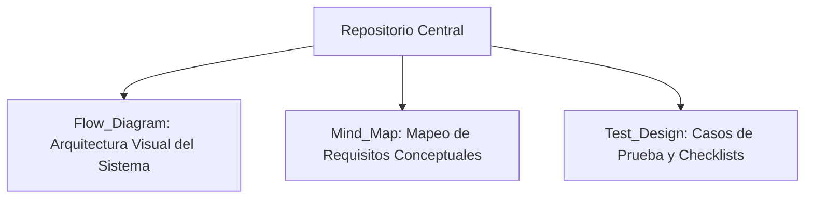

# 🗺️ Urban Routes - Análisis de Requisitos y Diseño de Casos de Prueba

*Leer este documento en otros idiomas: [English (Inglés)](./README.md)*

---

## 📋 Descripción del Proyecto
Este repositorio alberga la **Suite Integral de Análisis de Requisitos y Diseño de Pruebas** ejecutada sobre la plataforma de movilidad compartida **Urban Routes**. El objetivo primordial de esta fase consistió en desglosar especificaciones de negocio complejas (específicamente la lógica de cálculo de rutas, tarifas, perfiles de usuario y validación de licencias) en casos de prueba trazables y altamente estructurados.

La conversión de especificaciones en mapas visuales y matrices de prueba garantiza la máxima cobertura funcional antes del desarrollo y la ejecución de la automatización.

---

## 🛠️ Técnicas de Diseño de Pruebas Aplicadas
Para maximizar la cobertura y erradicar la redundancia en las pruebas, se aplicaron con rigor metodológico técnicas formales de diseño de caja negra:

*   **Partición de Clases de Equivalencia (ECP):** Segregación de dominios de entrada para perfiles de viaje (límites de búsqueda de conductores, capacidad de pasajeros y restricciones de licencia).
*   **Análisis de Valores Límite (BVA):** Evaluación de umbrales críticos de operación, tales como distancias de ruta límites y fronteras numéricas en tarifas de taxi.
*   **Diagramas de Transición de Estados:** Modelado del comportamiento dinámico del sistema para el ciclo de vida del pedido de viaje.
*   **Tablas de Decisión:** Mapeo de combinaciones de parámetros lógicos complejos (requisitos físicos del vehículo y calificaciones del conductor) para optimizar el set de pruebas.

---

## 📂 Estructura del Repositorio y Entregables

*   `Flow_Diagram/`: Flujogramas detallando el cálculo de rutas y flujos de lógica operativa.
*   `Mind_Map/`: Mapas mentales lógicos que trazan las dependencias de negocio entre perfiles de usuarios y restricciones funcionales.
*   `Test_Design/`: Matrices estructuradas de casos de prueba y listas de verificación organizadas por criticidad y módulo de cobertura.

---

## 🖥️ Alcance de la Validación
*   **Lógica Funcional de Rutas:** Verificación de umbrales en el cálculo dinámico de distancias.
*   **Consistencia de Flujos:** Aseguramiento de transiciones de estado correctas y control de errores del sistema.
*   **Compatibilidad de Perfiles:** Confirmación de reglas de negocio aplicadas a diferentes tarifas de usuario.